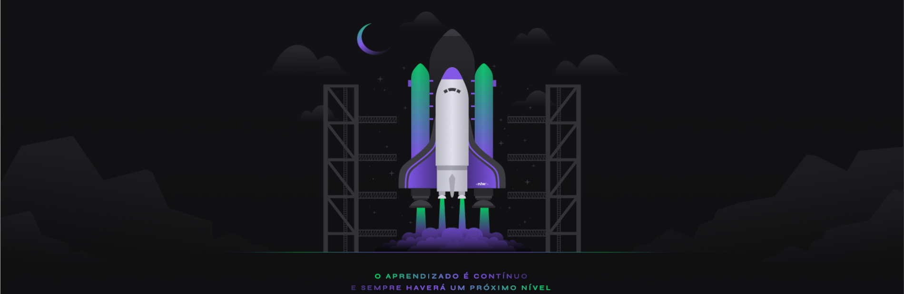

        
    <h2><strong>:rocket: Next Level Week 04 | Node.js | API | Envio de e-mail para Pesquisa de Satisfação Utilizando o Calculo do NPS :rocket:</strong></h2>
    

___

    

    

    

---

 • <a href="#-descricao">Descrição do Projeto</a> •
 <a href="#-funcionalidades">Funcionalidades</a> •
 <a href="#-testando-a-api">Testando a API</a> • 
 <a href="#-como-rodar">Como Rodar</a> • 
 <a href="#-consideracoes-finais">Considerações Finais</a> • 
 <a href="#-autor">Autor</a> • 
 <a href="#user-content--licença">Licença</a>

