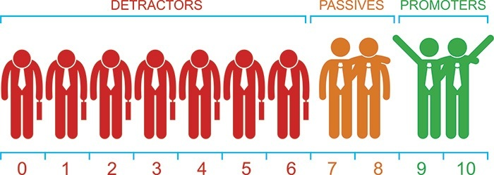

<div align="center">        
    <h2><strong>:rocket: Next Level Week 04 | Node.js | API | Envio de e-mail para Pesquisa de Satisfação Utilizando o Calculo do NPS :rocket:</strong></h2>    
    <a href="https://app.rocketseat.com.br/" >
        
    </a>
</div>

___

<h2 align="center"> :copyright: Licença | :file_folder: Dependências</h2>
<p align="center">

<a href="https://github.com/RandelSouza/next-level-week-4/blob/master/LICENSE" >
    
</a>

<a href="https://www.npmjs.com/package/express">
    
</a>

<a href="https://www.npmjs.com/package/express-async-errors" >

</a>

<a href="https://handlebarsjs.com/" >
    
</a>

<a href="https://www.npmjs.com/package/nodemailer" >
    
</a>

<a href="https://www.npmjs.com/package/reflect-metadata" >
    
</a>    

<a href="https://www.npmjs.com/package/sqlite3" >
    
</a>

<a href="https://www.npmjs.com/package/typeorm" >
    
</a>

<a href="https://www.npmjs.com/package/uuid" >
    
</a>    

<a href="https://www.npmjs.com/package/yup" >
    
</a>    
</p>

---

<p align="center" >
 • <a href="#black_nib-descrição-do-projeto">Descrição do Projeto</a> •
 <a href="#nut_and_bolt-funcionalidades">Funcionalidades</a> •
 <a href="#computer-testando-a-api">Testando a API</a> • 
 <a href="#arrow_forward-como-rodar">Como Rodar</a> • 
 <a href="#eight_spoked_asterisk-considerações-finais">Considerações Finais</a> • 
 <a href="#mag_right-autor">Autor</a> • 
 <a href="#copyright-licença">Licença</a>
</p>

---

## :black_nib: Descrição do Projeto
* O *Net Promoter Score* (NPS) é uma métrica que objetiva medir o grau de satisfação e lealdade dos clientes com as empresas. Organizações de todos os portes e lugares do mundo utilizam o NPS por ser um método prático e eficaz durante as pesquisas periódicas realizadas com seus clientes.

* O índice é avaliado de acordo com a resposta de uma única pergunta, como por exemplo a seguinte: `Em uma escala de 0 a 10, o quanto você indicaria a Rocketseat para um amigo?`.

* A questão da pesquisa é uma pergunta chave, pois pressupõe que ninguém indicaria algo ruim para um amigo. A resposta quantitativa de 0 a 10 viabiliza o calculo do NPS.

* Após o cliente dar sua nota, eles serão classificados da seguinte maneira.
    - Clientes **detratores** (***detractors***): notas de **0-6**.
        - clientes totalmente insatisfeitos :disappointed:.
    - Clientes **neutros** (***passives***): notas de **7-8**.
        - clientes com satisfação média :neutral_face:.
    - Clientes **promotores** (***promoters***): notas de **9-10**.
        - clientes totalmente satisfeitos :smiley:.
    
    <br/>

    

    <br/>

<!--img src="https://render.githubusercontent.com/render/math?math=e^{i %2B\pi} =x%2B1"-->
* **Cálculo do NPS**: 
    - **Onde**:
        - **detratores** = total de clientes que deram notas de **0-6**.    
        - **neutros** = total de clientes que deram notas de **7-8**.   
        - **promotores** = total de clientes que deram notas de **9-10**.
        - **respondentes** = **detratores + neutros + promotores**.

        Obs.: Os neutros não entram diretamente no cálculo, somente para o total de respondentes.
        
         <br/>

        

        <br/>
    
    - **Zona de classificação do NPS**:
        - **Excelência**: pontuação entre **75%** e **100%** :trophy:.
        - **Qualidade**: pontuação entre **50%** e **74%** :tada:.
        - **Aperfeiçoameto**: pontuação entre **0%** e **49%** :wrench:.
        - **Critica**: pontuação entre **-100%** e **-1%** :chart_with_downwards_trend:.

Fonte: [https://www.dds.com.br/blog/index.php/entenda-importancia-nps-para-sua-empresa/](https://www.dds.com.br/blog/index.php/entenda-importancia-nps-para-sua-empresa/). Acessado em 04/03/2021.

## :nut_and_bolt: Funcionalidades

O servidor ficará ouvindo requisições na URL: `http://localhost:3333/`

* **Criar um novo usuário**.    
    - **URL**: `http://localhost:3333/users`.
    - **Verbo HTTP**: `POST`.
    - **Corpo HTTP**:
        ```yaml        
        {
            "name": "User example create",
            "email": "user_example@test.com.br"           
        }
        ```
    - **EndPoint**:
        ```typescript
        router.post("/users", userController.create);
        ```
    - **Resposta**:
        ```yaml
        {
            "id": "7baeed55-554a-44ec-8a27-9d131542dca11",
            "name": "User example create",
            "email": "user_example@test.com.br",
            "created_at": "2021-02-06T15:18:13.000Z"
        }

        ```

* **Criar uma nova pesquisa**.
    - **URL**: `http://localhost:3333/surveys`.
    - **Verbo HTTP**: `POST`.
    - **Corpo HTTP**:
         ```yaml        
        {
            "title": "Pesquisa de opinião!",
            "description": "De 0 a 10 quanto você recomendaria a Rocketseat para um amigo?"
        }          
        ```    
    
    - **EndPoint**:    
        ```typescript
        router.post("/surveys", surveyController.create);
        ```

    - **Resposta**:
        ```yaml
       {
            "id": "f58bd1f0-3a06-44a0-87fb-34d137030676",
            "title": "Pesquisa de opinião",
            "description": "De 0 a 10 quanto você recomendaria a Rocketseat para um amigo?",
            "created_at": "2021-03-06T15:35:23.000Z"
        }
        ```

* **Mostrar as pesquisas criadas**.
    - **URL**: `http://localhost:3333/users`.
    - **Verbo HTTP**: `GET`.

    - **EndPoint**:  
        ```typescript
        router.get("/surveys", surveyController.show);    
        ```
    
    - **Resposta**:
    ```yaml
    [
        {
            "id": "f58bd1f0-3a06-44a0-87fb-34d137030676",
            "title": "Pesquisa de opinião",
            "description": "De 0 a 10 quanto você recomendaria a Rocketseat para um amigo?",
            "created_at": "2021-03-06T15:35:23.000Z"
        }
    ]
    ```

* **Enviar email para um determinado usuário**.
    - **URL**: `http://localhost:3333/sendMail`.
    - **Verbo HTTP**: `POST`.
    - **Corpo HTTP**:
        ```yaml
        {  
            "email": "user_example@test.com.br",
            "survey_id": "f58bd1f0-3a06-44a0-87fb-34d137030676"
        }
        ```

    - **EndPoint**:  
        ```typescript     
        router.post("/sendMail", sendEmailController.execute);
        ```

    - **Resposta**:    
        ```yaml
        {
            "id": "653badbb-8294-45d0-851b-253561d54efa",
            "user_id": "7baeed55-554a-44ec-8a27-9d131542dca11",
            "survey_id": "f58bd1f0-3a06-44a0-87fb-34d137030676",
            "created_at": "2021-03-06T17:41:39.000Z"
        }
        ```

* **Cadastrar nota do usuário**.     
    - **URL**: `http://localhost:3333/answers/${nota}?u=${survey_user_id}`.
        - Exemplo: `http://localhost:3333/answers/10?u=653badbb-8294-45d0-851b-253561d54efa`.
    - **Verbo HTTP**: `GET`.   

     - **EndPoint**:      
        ```typescript
        router.get("/answers/:value", answerController.execute);
        ```

    - **Resposta**: 
        ```yaml
        {
            "id": "653badbb-8294-45d0-851b-253561d54efa",
            "user_id": "532040d6-527b-43ca-8a0e-3c28a126472e",
            "survey_id": "6ef98252-cd36-466e-876e-17722479ff55",
            "value": 10,
            "created_at": "2021-03-06T17:41:39.000Z"
        }
        ```

* **Calcular o NPS de uma determinada pesquisa**.  
    - URL: .`localhost:3333/nps/${survey_id}`
        - Exemplo: `localhost:3333/nps/f58bd1f0-3a06-44a0-87fb-34d137030676`.
    - Verbo HTTP: `GET`.

     - EndPoint: 
        ```typescript
        router.get("/nps/:survey_id", npsController.execute); 
        ```
    - Resposta:
        ```yaml
        {
            "detractors": 0,
            "promoters": 1,
            "passive": 0,
            "totalAnswer": 1,
            "nps": 100.00
        }
        ```    

## :computer: Testando a API


## :arrow_forward: Como Rodar
```yaml
# Instalar as depêndencias
npm install

# Rodar os testes
npm run test

# Rodar o projeto
npm run dev

```

## :eight_spoked_asterisk: Considerações Finais

## :mag_right: Autor

<p>

<h5>Randel Souza Almeida</h5>
</p>

[](https://www.linkedin.com/in/randelsouza/)
[](mailto:randelsouza88@gmail.com)

## :copyright: Licença
Este projeto detém a <a href="https://github.com/RandelSouza/next-level-week-4/blob/master/LICENSE">Licença MIT</a>

* **Exigido**
    - :information_source: Aviso de licença e direitos autorais: inclua uma cópia da licença e aviso de direitos 
autorais com o código.

* **Permitido**
    - :heavy_check_mark: Uso comercial: o software e seus derivados podem ser utilizados para fins comerciais.
    - :heavy_check_mark: Modificação: o software pode ser modificado.
    - :heavy_check_mark: Distribuição: o software pode ser destribuido.
    - :heavy_check_mark: Sublicenciamento: Pode-se conceder uma sublicença para modificar e distribuir o software a terceiros não incluídos na licença.

* **Proibido**
    - :heavy_multiplication_x: Responsabilidade Assegurada: O software é fornecido sem garantia e o autor/licença do software não pode ser responsabilizado por perdas e danos.

---

<p align="center" >
 • <a href="#black_nib-descrição-do-projeto">Descrição do Projeto</a> •
 <a href="#nut_and_bolt-funcionalidades">Funcionalidades</a> •
 <a href="#computer-testando-a-api">Testando a API</a> • 
 <a href="#arrow_forward-como-rodar">Como Rodar</a> • 
 <a href="#eight_spoked_asterisk-considerações-finais">Considerações Finais</a> • 
 <a href="#mag_right-autor">Autor</a> • 
 <a href="#copyright-licença">Licença</a>
</p>

---
